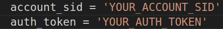
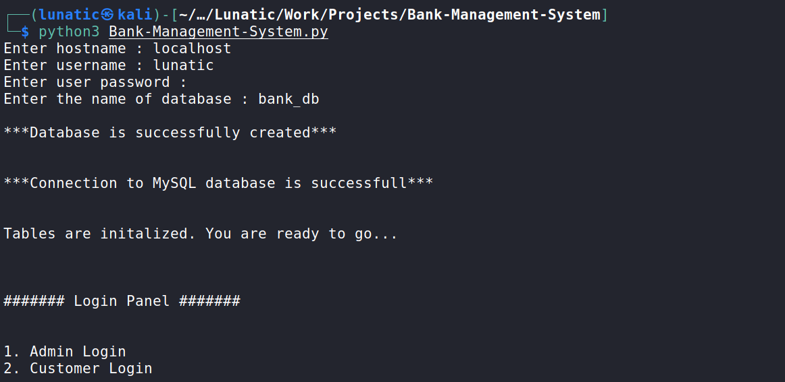
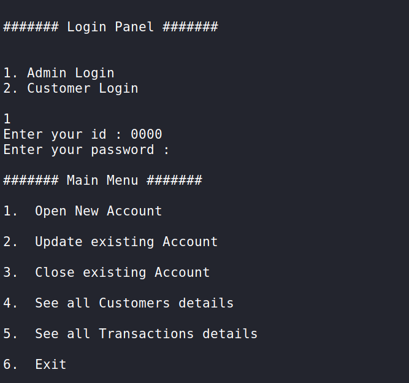
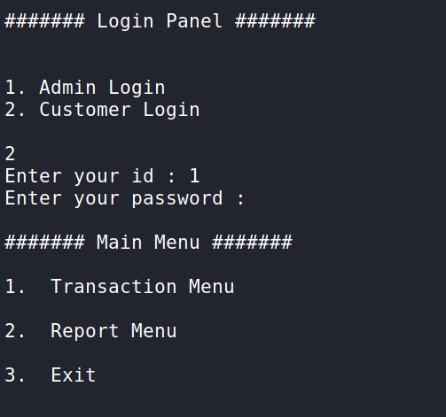
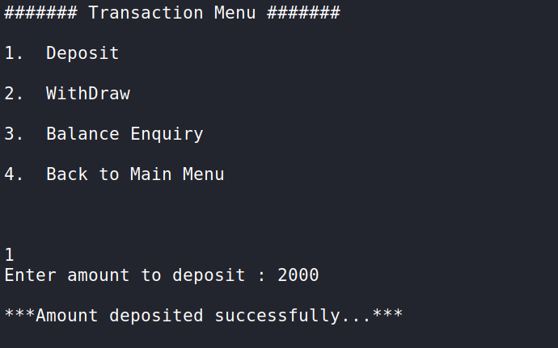
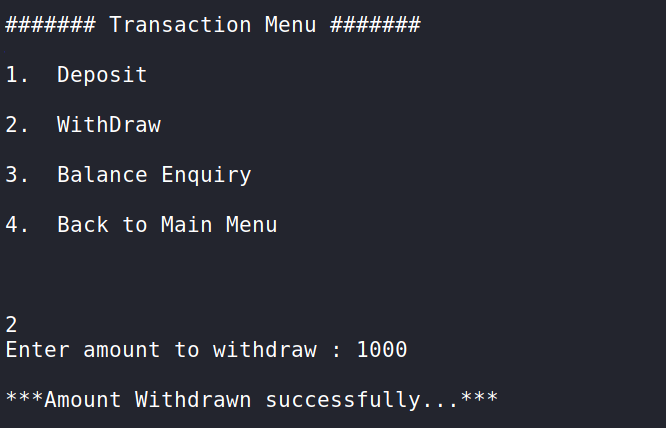
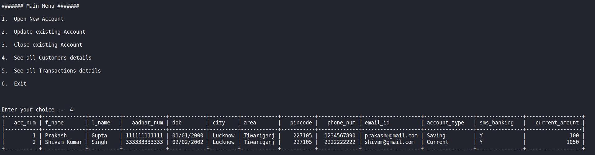
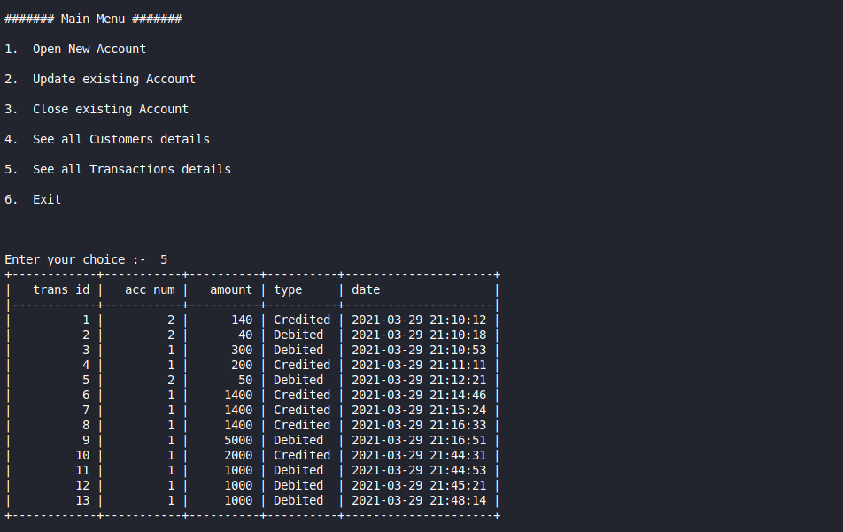
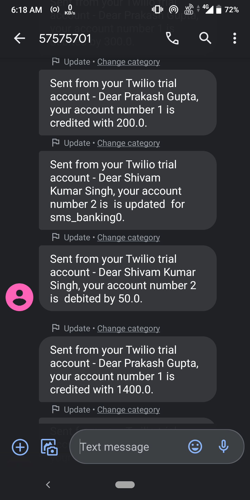

# Banking-Management-System
I've tried to implement banking system to some extent using Python3. It's only works in cmd/terminal mode. Just made this as a warm-up project for practicing Python and MySQL.

## Requirements :- 
- Python3
- Twilio
- MySQL
- (Optional) Internet connection (either slow or fast) - It is used only for sending sms to customer mobile number.

 ### Other Python Modules : -
 - Tabulate
 - Playsound
 
## How to install Requirements :-

1. **Python3** can be installed from their official site https://www.python.org/ . Or you can use anaconda environment.

2. **Twilio** can be installed using PIP :- 
```
pip3 install twilio
```

3.  You can install **MySQL** by following the procedure mentioned in official documentation on : - 
- For Linux : https://dev.mysql.com/doc/refman/8.0/en/linux-installation.html
- For WIndows : https://dev.mysql.com/doc/refman/8.0/en/windows-installation.html

Yeah, you should refer to youtube or stackoverflow for its installation XD.

4. **Playsound** can be installed using PIP :-
```
pip3 install playsound
```

## Description & Features :-

- This project includes implementation of some of common task of Banking-System. 
- SMS Banking also available. You'll be notified every time any transaction(deposit/withdraw) or update in any of your existing data is made.
- Currency counting sound and error sound are also available.

## Getting Started :-
- Admin credentials (You can change it in program) <br>
  **admin_id = 0000** <br>
  **admin_passwd = 'root'**
  
- Start your MySQL server :
  For windows -> ``` C:\> "C:\Program Files\MySQL\MySQL Server 8.0\bin\mysqld" ``` <br>
  For Linux -> ``` sudo systemctl start mysql ```
  
- (Optional) You can check your MySQL server : <br>
  For windows - ``` "C:\Program Files\MySQL\MySQL Server 8.0\bin\mysqlshow" -u root mysql ``` <br>
  For Linux - ``` "sudo mysql -u <username> -p" ```  <br>
  It might ask you for password, then enter your MySQL password. Replace <username> with your MySQL username.
  
  - Go login at <a href="https://www.twilio.com/console">Twilio Console </a> and set up your account and get your credentials(ACCOUNT_SID, AUTH_TOKEN) and a phone     number for sending sms. For more info you can look at :- <a href= "https://www.twilio.com/docs/sms/quickstart/python" >Twilio Python SMS </a> <br>
 
  Once you get your credentials and twilio mobile number place it in code at proper place(show in below screenshot)
  
    <br> 
     
  
 - Run the file by typing following command :-
 ```
 python3 Banking-Management-System.py
 ```
 
 - Intially after program runs, it will ask you for hostname, username, password, database name. <br>
   Enter **hostname = localhost** and **database name = bank_db** <br>
   Enter username and password according to your own MySQL credentials <br>
 Then just go with the flow...
  

## Output :- 
   
   1. Login Panel - This is the first screen you'll see.
   
   
   2. After admin login :
   
   
   3. After customer login :
   
   
   4. Transaction Menu - When customer selects Transaction and Deposit Money :
   
   
   5. Transaction Menu - When customer selects Transaction and Withdraw Money :
   
   
   6. When admin opens all customer details :
   
   
   7. When admin opens all transaction details :
   

   8. SMS-Banking messages :
   

## Dev :- Prakash Gupta
